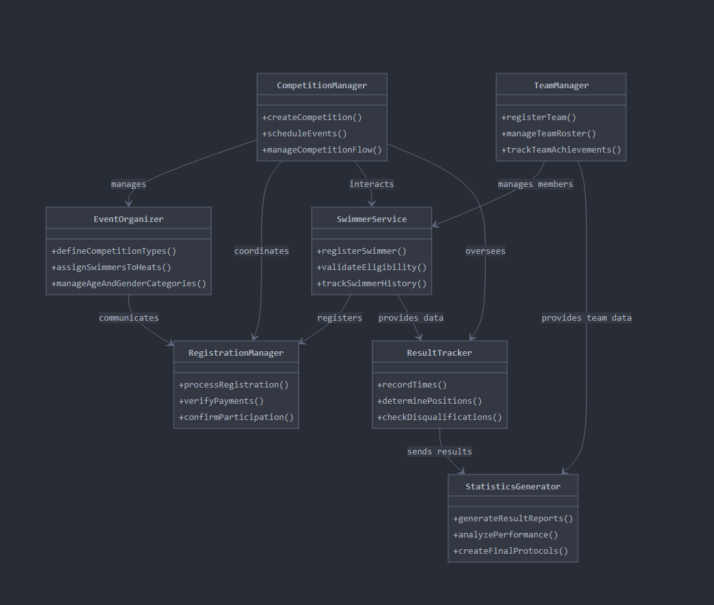

# AquaCompetitionAPI

## Swimming Competition Management System

### Project Purpose
SwimMeetManager is an advanced backend system designed for comprehensive management of swimming competitions. The project aims to streamline organization, registration, result tracking, and statistics generation for professional and amateur swimming events.

### System Architecture

#### Key System Components

1. **CompetitionManager**
   - Central class coordinating the entire competition process
   - Responsible for overall workflow and event management
   - Integrates all other system modules

2. **SwimmerService**
   - Comprehensive swimmer data management
   - Processes include:
     * New swimmer registration
     * Eligibility verification
     * Athlete performance history tracking

3. **EventOrganizer**
   - Specializes in competition details organization
   - Key functions:
     * Defining competition types
     * Assigning swimmers to heats
     * Managing age and gender categories

4. **RegistrationManager**
   - Handling the entire registration process
   - Main tasks:
     * Accepting registrations
     * Verifying payments
     * Confirming event participation

5. **ResultTracker**
   - Responsible for result measurement and recording
   - Functionalities:
     * Time registration
     * Determining swimmer positions
     * Disqualification verification

6. **TeamManager**
   - Swimming team management
   - Processes:
     * Team registration
     * Roster management
     * Tracking team achievements

7. **StatisticsGenerator**
   - Advanced reporting and analytics
   - Key functions:
     * Generating result summaries
     * Athlete performance analysis
     * Creating final protocols

### Design Principles
- Modular architecture
- Flexibility in competition management
- Easy extensibility and integration
- Comprehensive support for event organizers

### Technologies
- Spring Boot
- Java
- Maven
- Postman (API testing)

### Planned Functionalities
- Full competition registration
- Competition management
- Swimmer registration
- Real-time result tracking
- Report and statistics generation

## Installation (To be completed)

## Configuration (To be completed)

## API Documentation (To be completed)

## Contributors
- Karol Głąbik 
- Oliwier Gębczyński